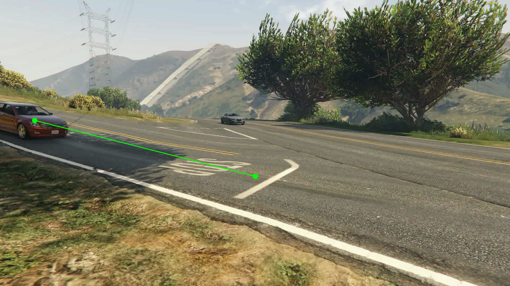
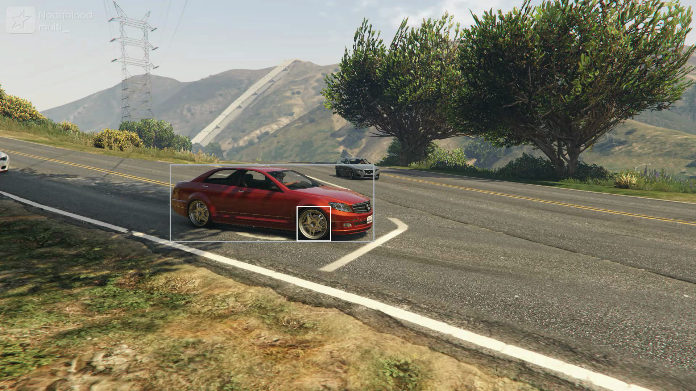
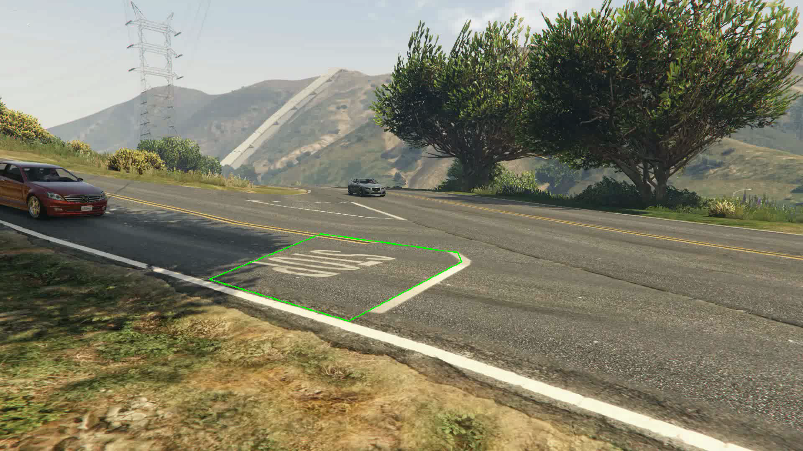
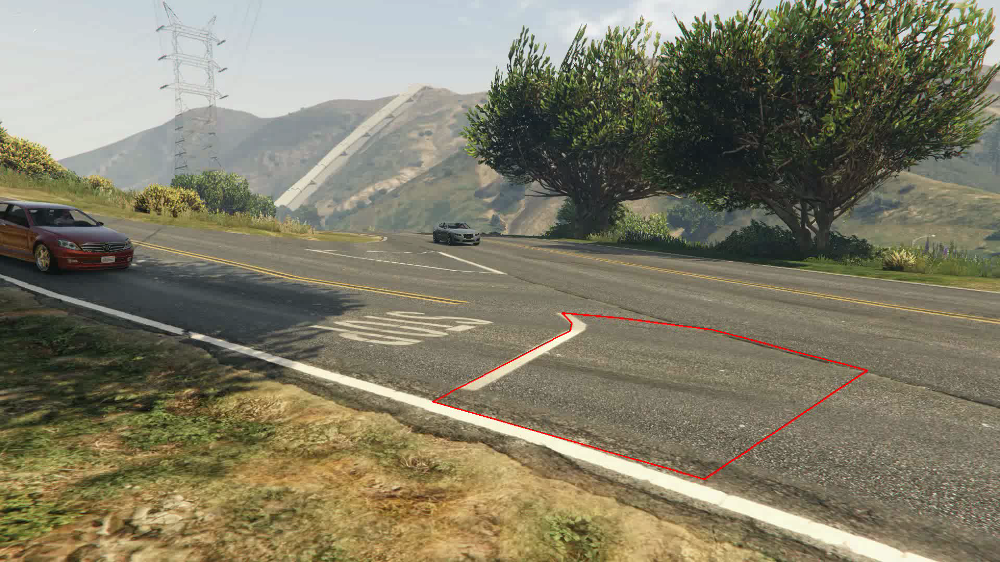
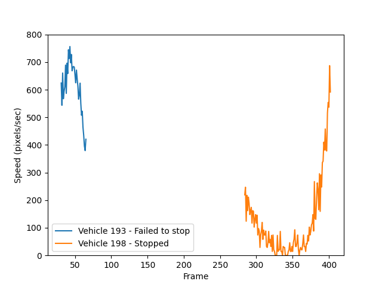

# Stop Sign Violation Detection
**Detect vehicles running stop signs using machine vision.** This project leverages YOLOv8, and a fine-tuned Roboflow detection model together with `roboflow` PolygonZones to identify all vehicles passing a stop sign. Video recordings of vehicles that fails to stop are then flagged for reporting. Part of my summer 2024 projects.


If you want to run the code yourself, follow these steps:
<details><summary><b>Installation</b></summary>

1. Clone this repository.
```bash
git clone https://github.com/Leonnorblad/DetStopViolation
cd DetStopViolation
```

2. Create virtual environment with python 3.11.9 e.g. conda (and install pip).
```bash
conda create --name DetStopViolation python==3.11.9
conda activate DetStopViolation
conda install pip
```

3. Install the dependencies listed in `requirements.txt`.
```bash
pip install -r requirements.txt
```

3. Create a .env file and add your Roboflow API key (replace <your_roboflow_api_key_here>).
```bash
echo "ROBOFLOW_API_KEY=<your_roboflow_api_key_here>" > .env
```

</details>

## 📚 Background

Speed cameras have been used in Sweden since the 1990s and effectivly reduce speeding [Source](https://sv.wikipedia.org/wiki/Fartkamera). These devices use radar, which is precise but costly.

Accurately detecting whether a vehicle stops at a stop sign requires meeting several criteria:
- The vehicle must be the first in line if there is a queue.
- The vehicle must stop close to the white line on the street.
- The vehicle must stop before the front wheel crosses the white line.

Given these requirements, traditional radar systems are insufficient. Deep learning could offer a more effective solution.

## 💡 The idea
One beautiful Swedish spring evening, I was enjoying a kebab outside [kronans kebab](https://g.co/kgs/rajZEDK). From the restaurant's outdoor seating, a stop sign was clearly visible. During my short meal, I observed multiple cars passing the stop sign without stopping.  At that time, I was deep into writing my thesis [Damage Detection in Circular Fashion](https://liu.diva-portal.org/smash/get/diva2:1880699/FULLTEXT01.pdf), which kept me updated on the latest advancements in computer vision.

Given that detecting cars has become quite straightforward with today's lightweight models, it occurred to me that implementing automatic stop sign detection using deep learning shouldn’t be too difficult.

## 🎥 Data
To avoid filming individuals running stop signs and lacking access to advanced computer simulators, I decided to simulate traffic scenarios using my favorite game, GTA V. The game's realistic graphics and customizable camera angles made it an ideal choice for creating accurate simulations for this project.

## 🧩 The solution

### **Vehicle detection**
YOLOv8 is used to detect vehicles within each frame. The model processes the input and provides positional detections. Only the detections corresponding to motor-driven road vehicles: *car, motorcycle, bus, truck* are retained.

### **Road-Zone filtering**
Only vehicles that are detected within the designated road-zone, where the stop sign is located, are considered. This is achieved by applying a filter that requires the center bottom point of the vehicle to be within the boundary of the road-zone.


### **Closest-to-line filtering**
To identify which vehicle is closest to the white line, a reference point is used. Only the vehicle with the shortest distance to this point is considered. The reference point is strategically placed near the center of the white line, ensuring accurate measurement of proximity.



### **Front wheel detection**
For each detected vehicle, the location of the front wheels is identified to determine if the vehicle has crossed the white line. This is achieved by slicing the vehicle from the frame and feeding the sliced segment into a fine-tuned detection model specifically designed to locate wheels. The detection coordinates are then transformed relative to the original frame.

This two-stage detection approach involves running inference on two models in series, which increases inference time. However, it simplifies the process by clearly associating each wheel detection with its corresponding vehicle.

Training a wheel-detection model is relatively straightforward, so I decided to use an automatic training platform. I found [this dataset of wheels](https://universe.roboflow.com/class-oyl7p/wheels-detection-vuaey/dataset/1) online and uploaded it to [roboflow](https://app.roboflow.com/) for auto-training. The training process took about an hour, and once completed, the model could be easily accessed via their API. Although it offered limited customization, the process was very simple, and I highly recommend it for users with minimal experience in traning machine learning models.



### ***Stopzone* detection**
To ensure that a vehicle stops just before the white line, a *stopzone* is utilized. The vehicle's wheels must be within this zone for the stop to be considered valid. The location of the wheels' bottom center is used to determine if they are inside the zone. If the predicted wheel position is correct, this should be where the wheels contact the ground.



### ***Outzone* detection**
To detect when a vehicle has failed to stop properly, an *outzone* is used. Similar to the *stopzone*, it monitors the vehicle's wheels to determine if they have left the area.



### **Vehicle movement**
The vehicle moment is monitored as the difference in pixels of the vehicle center between consecutive frames. Due to the inherent noise in detection, the center location may vary slightly. This is mitigated by setting a threshold for stopping: a movement of less than 15 pixels per second. This approach is simpler than calculating actual speed (like [this](https://blog.roboflow.com/estimate-speed-computer-vision/)). The speeds of vehicles with a front wheel in the stopzone can be plotted as:



## 📊 Video analysis
To determine whether a vehicle has stopped correctly at the stop sign, the detection is reviewed during an analysis step.

**Detection of a valid stop (label: stopped)**

> *If the center position of the vehicle reaches a movement of less than 15 pixels per second and a wheel of the vehicle is within the stopzone.*

**Detection of a failed stop (label: failed to stop)**

> *If a wheel that was previously within the stopzone enters the outzone and the vehicle has not come to a complete stop during the time in the stopzone.*

Note that all vehicles evaluated for these criteria meet the initial requirements of being on the road where the stop sign is located and being the vehicle closest to the white line.

## ✨ Putting it all together!


## 🛑 Method limitations

### ➡ Failed to stop
The first wheel to enter the *outzone* after being in the *stopzone* is identified as the front wheel. This wheel is used as the trigger for the "failed to stop" label. This approach aims to be robust against false positive wheel detections.

| False positives                                                                                               | False negatives                                                                                       |
|---------------------------------------------------------------------------------------------------------------|-------------------------------------------------------------------------------------------------------|
| The first wheel to enter the *outzone* after being in the *stopzone* is identified as the front wheel. This wheel is used as the trigger for "failed to stop." This approach is designed to be robust against false positive wheel detections.| If the front wheel is not detected in both the *stopzone* and the *outzone*, the vehicle cannot be identified as "failed to stop." |

### ➡ Stopped
A vehicle is considered stopped if the speed of its center position is below 15 pixels/second while a wheel is in the *stopzone*.

| False positives                                                                                         | False negatives                                                                                                    |
|-----------------------------------------------------------------------------------------------------------|--------------------------------------------------------------------------------------------------------------------|
| A false positive could occur if the vehicle is still moving but its center position movement is less than 15 pixels/second.| False negatives can occur if there is significant detection noise, preventing the speed threshold from being met. |


## 🚀 Future work
**License plate recognition:** With real-world data, future improvements could include adding license plate recognition. The input to such a model could be the detection coordinates of the vehicle and a cropped video segment containing only the vehicle that failed to stop.

**Smoothing vehicle location:** Vehicle detections can be noisy, therefore the speed estimates will also be noisy. Techniques such as Kalman filtering or moving averages could be applied to smooth the vehicle's center position, thereby reducing noise in the speed calculations. This was a feature I was working on but a simple threshold seems to be enough.

Interested in developing this idea further? Let's connect and make it happen! 😎
